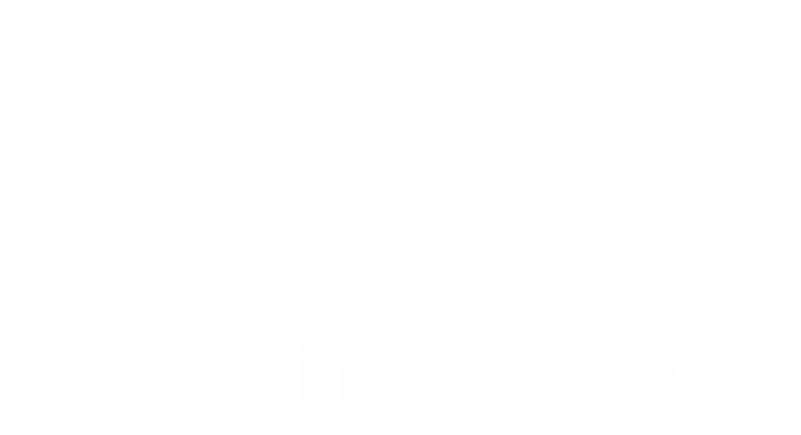

  

<h1 align="center">Synalab</h1>

  <strong>Educación Tecnológica Consciente</strong> 
  Estudio independiente de creación de software funcional impulsado por inteligencia artificial. 
  <em>Desde la educación, para problemas reales.</em>

  

  
  
  

---

## ¿Qué es Synalab?

Estudio independiente con sede en **Cali, Colombia**, dedicado a la creación de software funcional con propósito pedagógico. Combinamos formación tecnológica con desarrollo de herramientas reales para instituciones educativas y profesionales del aprendizaje.

> Conoce el manifiesto completo en [synalabedu.github.io/manifiesto](https://synalabedu.github.io/manifiesto)

## Acerca de este repositorio

Código fuente del **sitio web oficial de Synalab**, construido como sitio estático y desplegado automáticamente en GitHub Pages.

### Stack técnico

| Capa | Tecnología |
|---|---|
| Framework | [Astro](https://astro.build/) 6.x |
| Estilos | [Tailwind CSS](https://tailwindcss.com/) v4 |
| Tipado | TypeScript estricto |
| CMS | [Sveltia CMS](https://github.com/sveltia/sveltia-cms) (sin backend) |
| Búsqueda | [Pagefind](https://pagefind.app/) (índice estático) |
| Analítica | [GoatCounter](https://goatcounter.com/) (sin cookies) |
| Formularios | [Formspree](https://formspree.io/) |
| Hosting | GitHub Pages |
| CI/CD | GitHub Actions |

### Filosofía técnica

- **Local-first** — todo el contenido se sirve desde el navegador del usuario
- **Privacidad por diseño** — sin tracking invasivo, sin cookies de terceros
- **Estático** — generado en build, servido como HTML/CSS/JS plano
- **Seguridad como práctica continua** — CSP, SRI, HSTS, security.txt, Dependabot, CodeQL

## Licencia

El **código** de este repositorio está bajo licencia [MIT](LICENSE). Eres libre de usar, modificar, distribuir o vender el código manteniendo el aviso de copyright original.

El **contenido editorial** (textos, imágenes, recursos pedagógicos, manifiesto) tiene licencias específicas indicadas en cada proyecto y recurso, generalmente bajo Creative Commons. Consulta cada pieza de contenido para conocer sus términos específicos.

---

  Construido con propósito. 
  Documentado con disciplina. 
  Pensado para durar.

